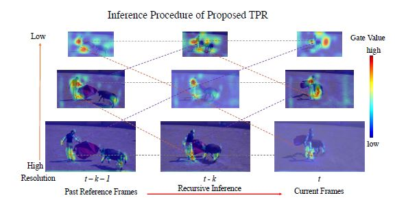

#   Improving Video Instance Segmentation via Temporal Pyramid Routing [[PAMI-2023]](https://arxiv.org/abs/2107.13155)

## Code will be released the total training and evaluation codes after ICCV-DDL. Please stay tuned.

To incorporate both temporal and scale information, we propose a Temporal Pyramid Routing (TPR) strategy to conditionally
align and conduct pixel-level aggregation from a feature pyramid pair of two adjacent frames. Specifically, TPR
contains two novel components, including Dynamic Aligned Cell Routing (DACR) and Cross Pyramid Routing (CPR),
where DACR is designed for aligning and gating pyramid features across temporal dimension, while CPR transfers
temporally aggregated features across scale dimension. We valid our method on two chanllenging video understanding tasks, including Video Instance Segmentation (VIS) and Video Panoptic Segmentation (VPS).

 
 

